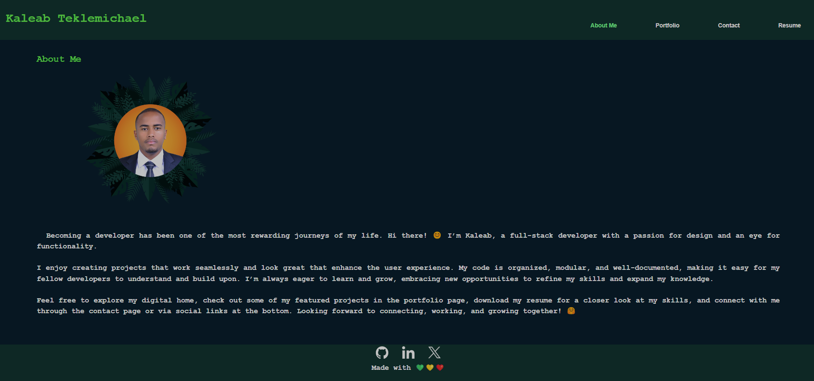
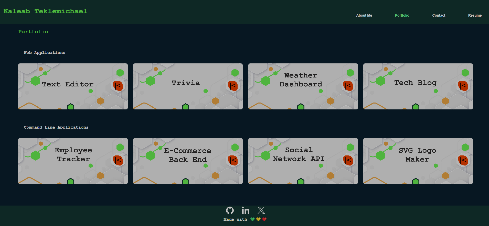
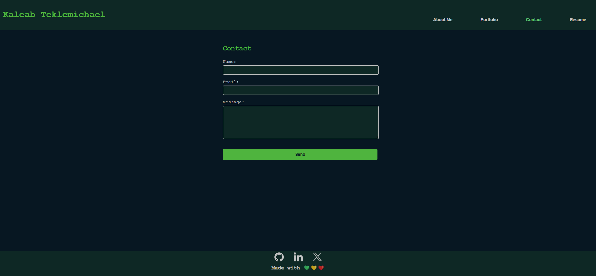
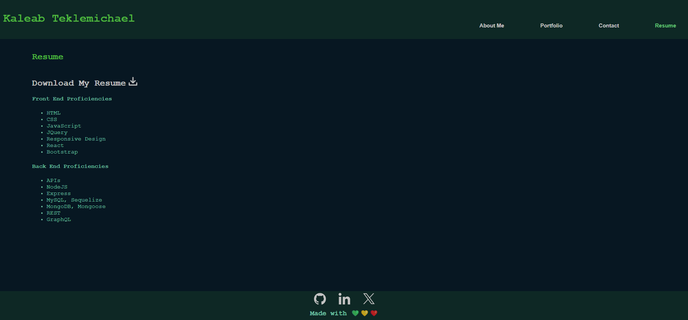

  

  

## **Kaleab's Portfolio Website**

## Description
This single-page app keeps things simple and organized, with four sections: About Me, Projects, Resume, and Contact. It highlights my journey as a developer and is designed to give you a quick, easy way to explore my work, download my resume, and get in touch. Each section highlights who I am as a developer and some of my projects

## Deployed Application URL
https://kaleab-teklemichael.netlify.app/

## Repository URL
https://github.com/Baelak/KT-M20-react-Portfolio

## Table of Contents
* [Features](#features)
* [Dependencies](#dependencies)
* [Languages and Technologies](#languages-and-technologies)
* [Screenshots](#Screenshots)
* [Contributors](#contributors)
* [Testing](#testing)
* [Questions](#questions)

## Features
One useful feature of this website is that the css code is modularized insprired by react it is serparated on component basis and it makes the page easier to manage. The css also comments for easy customization later on and for anyone who works on it.

## Dependencies
Nodemon, Express, React, React-dom

## Languages and Technologies:
**Javascript**, and **HTML** are the language used, while the technologies used  are **Node.js**, **Express.js**, and **Netlify**.

## Screenshots

## Contributors
None

## Testing
None

## Questions
Please send your questions [here](mailto:teklemichaelkaleab@gmail.com?subject=[GitHub]%20Dev%20Connect) or visit [github/Baelak](https://github.com/Baelak).